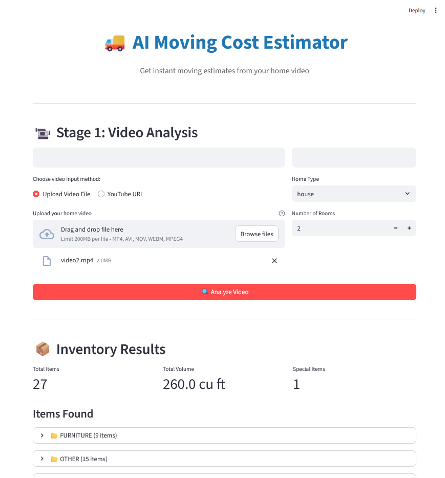
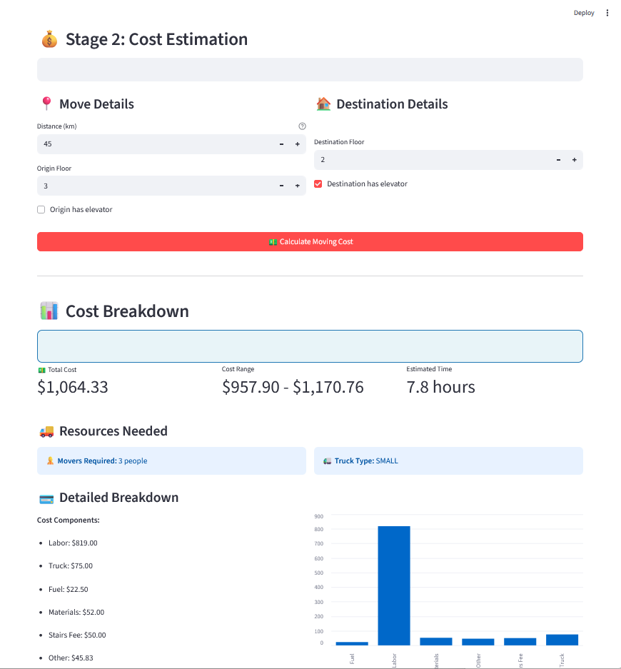

# 🚚 AI Moving Cost Estimator


An intelligent moving cost estimation system powered by Google's Gemini AI that analyzes home videos to automatically inventory furniture and calculate accurate moving costs.
<p align="center">
  
</p>
## 📋 Overview

This project uses advanced AI video analysis to:
- **Automatically detect and inventory** all furniture, appliances, and household items from a home video
- **Calculate accurate moving costs** based on distance, floor levels, and item complexity
- **Provide detailed breakdowns** of labor, materials, truck rental, and additional fees
- **Offer multiple interfaces** - CLI script, REST API, and interactive web UI

## ✨ Features

### 🎥 Video Analysis (Stage 1)
- Upload local video files or provide YouTube URLs
- AI-powered item detection and categorization
- Automatic volume estimation in cubic feet
- Special handling identification (pianos, large wardrobes, fragile items)
- Support for both apartments and houses

### 💰 Cost Estimation (Stage 2)
- Intelligent mover count recommendation (2-6 people)
- Truck size optimization (small/medium/large)
- Distance-based fuel cost calculation
- Stairs fee calculation (with elevator detection)
- Packing materials cost estimation
- Complexity-based time adjustments
- Cost range estimation (±10%)

### 🖥️ Multiple Interfaces
1. **CLI Script** (`main.py`) - Direct Python execution
2. **REST API** (`move.py`) - FastAPI-based web service
3. **Web UI** (`streamlit.py`) - Interactive Streamlit dashboard

## 🚀 Quick Start

### Prerequisites

- Python 3.8 or higher
- Google Gemini API key ([Get one here](https://ai.google.dev/))

### Installation

1. **Clone the repository**
   ```bash
   git clone <repository-url>
   cd trial
   ```

2. **Create a virtual environment** (recommended)
   ```bash
   python -m venv venv
   
   # Windows
   venv\Scripts\activate
   
   # macOS/Linux
   source venv/bin/activate
   ```

3. **Install dependencies**
   ```bash
   pip install -r requirements.txt
   ```

4. **Set up environment variables**
   
   Create a `.env` file in the project root:
   ```env
   GEMINI_API_KEY=your_api_key_here
   ```

## 📖 Usage

### Option 1: CLI Script

Run the standalone script for quick estimates:

```bash
python main.py
```

**Example in code:**
```python
from main import estimate_moving_cost

result = estimate_moving_cost(
    video_path="path/to/your/video.mp4",  # or YouTube URL
    distance_km=45,
    origin_floor=3,
    destination_floor=2,
    has_elevator_origin=False,
    has_elevator_destination=True,
    home_type="apartment",
    room_count=3
)

print(result)
```

### Option 2: REST API

Start the FastAPI server:

```bash
python move.py
# or
uvicorn move:app --reload
```

The API will be available at `http://localhost:8000`

**API Documentation:** Visit `http://localhost:8000/docs` for interactive Swagger UI

**Example API Usage:**

```bash
# Stage 1: Analyze video
curl -X POST "http://localhost:8000/api/v1/analyze-video" \
  -F "video_file=@/path/to/video.mp4" \
  -F "home_type=apartment" \
  -F "room_count=3"

# Stage 2: Calculate cost
curl -X POST "http://localhost:8000/api/v1/estimate-cost" \
  -H "Content-Type: application/json" \
  -d '{
    "items": [...],
    "total_volume_cubic_feet": 800,
    "distance_km": 45,
    "origin_floor": 3,
    "destination_floor": 2,
    "has_elevator_origin": false,
    "has_elevator_destination": true
  }'
```

### Option 3: Web UI (Streamlit)

Launch the interactive web interface:

```bash
streamlit run streamlit.py
```

The web app will open automatically at `http://localhost:8501`

**Features:**
- Drag-and-drop video upload or YouTube URL input
- Real-time inventory display with categorization
- Interactive cost calculator with detailed breakdowns
- Visual charts and metrics
- Downloadable JSON reports

## 📁 Project Structure

```
trial/
├── main.py              # CLI script for direct usage
├── move.py              # FastAPI REST API server
├── streamlit.py         # Streamlit web UI
├── requirements.txt     # Python dependencies
├── .env                 # Environment variables (API keys)
├── videos/              # Sample video files
└── README.md            # This file
```

## 🔧 Configuration

### Pricing Configuration

Default pricing can be customized in `PRICING_CONFIG` (found in both `main.py` and `move.py`):

```python
PRICING_CONFIG = {
    "labor_rate_per_hour": 35,           # $ per hour per mover
    "truck_rates": {
        "small": 75,                      # Base truck rental
        "medium": 120,
        "large": 180
    },
    "fuel_cost_per_km": 0.5,             # $ per kilometer
    "stairs_fee_per_floor": 25,          # $ per floor without elevator
    "packing_material_per_cubic_feet": 0.20,  # $ per cubic foot
    "base_hours": 4,                     # Minimum hours
    "hour_per_100_cubic_feet": 0.5      # Additional hours per 100 cu ft
}
```

### Video Input Support

- **Local files:** MP4, AVI, MOV, WebM
- **File size limits:**
  - Small files (<20MB): Inline processing
  - Large files (≥20MB): File API upload
- **YouTube URLs:** Direct URL support

## 📊 API Endpoints

| Endpoint | Method | Description |
|----------|--------|-------------|
| `/` | GET | API information and available endpoints |
| `/health` | GET | Health check endpoint |
| `/api/v1/analyze-video` | POST | Analyze video and extract inventory |
| `/api/v1/estimate-cost` | POST | Calculate moving cost from inventory |

## 🧪 Example Output

```json
{
  "inventory": {
    "items": [
      {"name": "sofa", "quantity": 1, "size": "large", "category": "furniture"},
      {"name": "dining table", "quantity": 1, "size": "large", "category": "furniture"},
      {"name": "refrigerator", "quantity": 1, "size": "large", "category": "appliance"}
    ],
    "total_volume_cubic_feet": 800,
    "needs_special_handling": ["piano"]
  },
  "cost_estimate": {
    "total_cost": 1247.50,
    "cost_range": [1122.75, 1372.25],
    "movers_needed": 3,
    "truck_type": "medium",
    "estimated_hours": 8.5,
    "breakdown": {
      "labor": 892.50,
      "truck": 120.00,
      "fuel": 22.50,
      "materials": 160.00,
      "stairs_fee": 50.00,
      "other": 2.50
    },
    "special_notes": "Piano requires extra care and time"
  }
}
```

## 🛠️ Technologies Used

- **AI/ML:** Google Gemini 2.5 Flash (video analysis & intelligent estimation)
- **Backend:** FastAPI, Uvicorn
- **Frontend:** Streamlit
- **Video Processing:** Google GenAI File API
- **Environment:** Python-dotenv
- **Data Validation:** Pydantic

## 📝 Requirements

See `requirements.txt` for full dependencies:

```txt
google-genai>=0.2.0
python-dotenv
streamlit
requests
fastapi
uvicorn[standard]
python-multipart
```

## 🔐 Environment Variables

| Variable | Description | Required |
|----------|-------------|----------|
| `GEMINI_API_KEY` | Google Gemini API key | Yes |
| `API_BASE_URL` | Base URL for API (Streamlit only) | No (defaults to localhost:8000) |

## ⚠️ Important Notes

- **API Key Security:** Never commit your `.env` file to version control
- **Video Quality:** Higher quality videos produce more accurate inventories
- **Estimates:** AI-generated estimates may vary from actual costs by ±10%
- **Processing Time:** Large videos may take several minutes to process
- **Rate Limits:** Respect Google Gemini API rate limits

## 🚧 Limitations

- Video analysis accuracy depends on video quality and lighting
- Some small items may not be detected
- Cost estimates are based on general market rates and may vary by location
- YouTube video analysis requires public or unlisted videos

## 🔮 Future Enhancements

- [ ] Database integration for storing estimates
- [ ] User authentication and history tracking
- [ ] PDF report generation
- [ ] Email notifications
- [ ] Multi-language support
- [ ] Mobile app integration
- [ ] Real-time video streaming analysis
- [ ] Integration with moving company APIs

## 🤝 Contributing

Contributions are welcome! Please feel free to submit a Pull Request.

## 📄 License

This project is provided as-is for demonstration purposes.

## 🙋 Support

For issues or questions:
1. Check the API documentation at `/docs`
2. Review the example code in `main.py`
3. Ensure your Gemini API key is valid and has sufficient quota

## 🎯 Use Cases

- **Moving Companies:** Automate quote generation
- **Real Estate:** Help clients estimate moving costs
- **Personal Use:** Plan and budget for home moves
- **Insurance:** Assess household inventory value

---

**Built with ❤️ using Google Gemini AI**

*Estimates are AI-generated and should be verified with professional moving companies*
